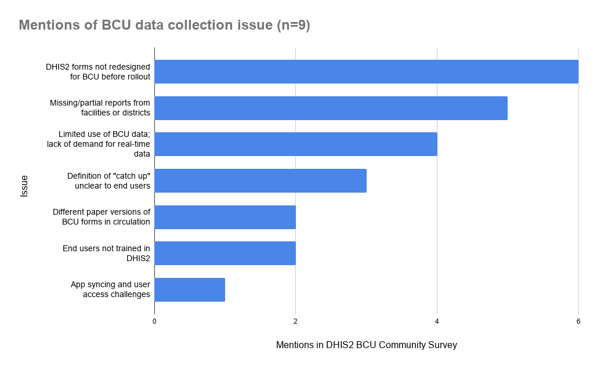

# Addressing BCU Data Backlogs and Sustaining Real-Time Monitoring Data {#imm_bcu-backlog-rtm}

## Introduction and Background {#imm_bcu-backlog-rtm-intro}

The Big Catch-Up (BCU) is a [global initiative launched in April 2023](https://www.unicef.org/press-releases/big-catch-up), led by WHO, UNICEF, Gavi, and other global partners, to close the immunization gaps caused by significant disruptions during the COVID-19 pandemic. The initiative focuses on reaching Zero-Dose and Under-Immunized children, particularly those aged 12 to 59 months, who missed routine vaccinations between 2019 and 2022.

**The scale of this challenge is significant.** Before BCU activities began, an estimated 25 million zero-dose (ZD) children existed globally, with over 6 million additional children becoming zero-dose between 2019 and 2022. Individual countries faced steep immunization backlogs: Ethiopia estimated [3.9 million zero-dose children](https://www.technet-21.org/en/resources/presentation/deep-dive-on-big-catch-up-monitoring-in-ethiopia-presentation-slides) from the 2019–2022 period, Tanzania identified over [one million children](https://www.technet-21.org/en/resources/presentation/bcu-monitoring-in-tanzania) aged 1–5 years without any vaccination, and Mozambique mapped [876,841 zero-dose and under-immunized children](https://www.technet-21.org/en/resources/webinar/deep-dive-on-big-catch-up-monitoring-in-mozambique-video).

The BCU initiative supports 35 countries where immunization coverage has stagnated or declined, although implementation modalities are tailored to each country context. To monitor BCU progress, all countries submit quarterly reports on children reached and doses disbursed to the global BCU Monitoring, Evaluation and Learning (MEL) task force, with results compiled in publicly available global dashboards. In parallel, programmes report annually into the WHO/UNICEF Electronic Joint Reporting Form (eJRF) to inform analysis of global immunization trends across all WHO member states.

**Data gaps have emerged as a critical barrier to success.** Most BCU countries customized paper-based and digital tools for BCU implementation — many doing so mid-implementation or only partially. Several data backlogs and harmonization challenges arose, causing discrepancies between national, partner, and global reports. In early 2022, only [47% of countries with relevant data systems reported antigen-level delayed-dose data into the eJRF](https://verixiv.org/articles/2-123/v2), despite 64% indicating they had systems capable of capturing such data. As of 2024, an estimated three quarters of BCU countries could digitally capture delayed doses, a still significant gap.

In 2025, the HISP Centre at UiO, in partnership with UNICEF, released a [DHIS2 toolkit for BCU](https://dhis2.org/events/big-catch-up-module-launch/) that included BCU aggregate data collection forms, dashboards, and guidance for adapting Electronic Immunization Registries (EIRs) to capture catch-up doses.

This guidance focuses on two interrelated challenges:

1. **Addressing BCU data backlogs** — how to bring historical BCU data, recorded in paper registers, spreadsheets, or other tools, into DHIS2 for consolidated reporting, and speed up the process of DHIS2 data entry.

2. **Institutionalizing catch-up dose monitoring** — how to modify routine immunization data forms and workflows so that catch-up doses are captured sustainably as part of ongoing health information systems.

Guidance is based on HISP experiences during the development and deployment of the BCU toolkit, as well as a desk review of global and country-level reports on BCU data systems. Further input was provided through a survey on BCU data systems distributed to the DHIS2 Community of Practice and several follow-up interviews.

---

## Data Backlog {#imm_bcu-backlog-rtm-rootcauses}

### Root Causes of Data Backlogs

BCU data backlogs arise from a combination of programmatic, technical, and organizational factors, as well as external factors such as inadequate funding, natural disasters, or conflict. Understanding these root causes is the starting point for designing appropriate solutions. Countries are encouraged to assess their own root causes systematically before selecting corrective actions, as solutions should be matched to the specific drivers identified at national and subnational levels.

The following root cause categories [have been identified](https://www.technet-21.org/en/resources/tool/improving-catch-up-data-completeness-and-timeliness-a-handbook-on-root-causes-and-solutions-to-address-data-backlogs) across BCU-implementing countries:

#### Guidance and Capacity Building Gaps

- Lack of clear SOPs for defining and reporting catch-up doses
- Limited training or absence of job aids for using paper-based and digital reporting tools
- Unclear distinctions between routine and catch-up doses at facility level
- Lack of clarity on catch-up/BCU data flow processes, timelines, and roles
- Delayed revision and dissemination of paper tools (tally sheets, registers), resulting in incorrect or missing data from earlier BCU vaccination activities

> In Tanzania, multiple versions of the [vaccination card](https://www.technet-21.org/en/resources/presentation/catch-up-vaccination-insights-from-5-big-catch-up-country-case-studies-presentation-slides) were circulating across districts simultaneously, with some missing Rota 3 or IPV, leading to inconsistent data capture and retrospective reconciliation.

#### Technology and Delayed Systems Design

- Digital tools not configured to distinguish routine vs. catch-up doses across reporting, stock, and forecasting modules
- Fragmented, non-interoperable systems (e.g., separate tools for campaign vs. routine activities)
- Delayed system customization to include children 12–59 months
- Slow, unstable digital applications or system bugs affecting data entry
- Mid-implementation migration from spreadsheets (e.g., Google Sheets) to more sustainable tools, creating retrospective data entry needs
- Inconsistencies in reporting standards across tools — misaligned age groups, antigen names, reporting periods, administrative hierarchies, and validation timelines — that complicate data integration

> In Tanzania, DHIS2 was not ready when BCU activities launched; an interim Google Sheets and AFYA campaign data system was used, and integration into DHIS2 did not begin until January 2025. In Mozambique, DHIS2 (SISMA) configuration delays led to reliance on paper-based daily summary books and monthly summary sheets. Nepal had not configured DHIS2 for antigen-specific reporting for the 24–59-month age group. In Ethiopia, DHIS2 integration challenges were cited by the country team as a key "do differently" recommendation; a separate Google Sheets form was used alongside routine registers throughout BCU implementation.

#### Infrastructure Barriers

- Insufficient or low-quality devices (limited storage, battery issues)
- Limited data bundles or slow/unstable internet connectivity
- Shortages of revised paper tools (tally sheets, registers, reporting forms)
- Server downtime or inadequate server capacity to support timely data entry

> Analysis of COVID-19 data backlogs in DRC, Kenya, Senegal, and Tanzania found that in Kenya, 58% of facilities reported unreliable connectivity as a constraint; in Tanzania, daily server crashes were reported by 56% of respondents (Carnahan et al., 2024). These infrastructure constraints likely also impact BCU data entry.

#### Health Workforce Constraints

- High staff turnover affecting the continuity of reporting practices
- Competing workload from multiple interventions and parallel reporting systems
- Limited supervision, follow-up, or motivation for timely data entry
- Insufficient engagement of key technical and programme staff at subnational levels

> In DRC and Tanzania, delayed payment of campaign incentives significantly reduced motivation for accurate record-keeping during COVID-19 vaccination (Carnahan et al., 2024). Endemic challenges of inconsistent payments and staff turnover at primary care level likely complicate BCU outreach and PIRI activities.

#### Systems Architecture and Governance

- Multiple non-interoperable or parallel reporting systems, leading to duplication and inconsistent data entry
- Irregular or absent data review meetings, resulting in weak follow-up and reporting
- Inconsistent timelines for data validation, triangulation, and submission across districts, partners, or stakeholders
- Insufficient coordination between MoH, WHO, and UNICEF data teams, causing misaligned reporting expectations and fragmented support

> In Cameroon, a combination of IASO, ODK, and DHIS2 was used without full interoperability; integration into routine DHIS2 was recommended as a priority for institutionalization.

#### Process Misalignment

- Implementation starting before dedicated BCU vaccines arrived
- Multiple strategies used (PIRI, campaigns, outreach) with different reporting tools and workflows
- Paper forms not aligned with digital data entry screens
- Separate data capture and entry workflows leading to delays

Countries employed various approaches for the BCU, including routine service delivery, **Periodic Intensification of Routine Immunization (PIRI)**, **Supplementary Immunization Activities (SIAs)**, school-based interventions, and targeted outreach for zero-dose children. Each strategy has distinct data capture requirements. **PIRI doses are counted as routine immunization** and must be recorded on home-based records (HBRs), registers, and tally sheets, disaggregated by age cohort. **SIA doses are supplemental** — they are not included in routine administrative coverage estimates and should be reported separately in the eJRF "Supplemental Activities" section.

Where countries combined strategies without aligning their recording tools, data from different activities accumulated in separate, incompatible sources, making consolidation difficult.

#### Data Source Misalignment

Even where BCU data was effectively collected, discrepancies between data sources can create harmonization challenges that impede data use. In Mozambique, [community mapping identified 262,838 zero-dose children](https://www.technet-21.org/en/resources/presentation/deep-dive-on-big-catch-up-monitoring-in-mozambique), compared to 762,041 in the national DHIS2 system, SISMA — a nearly threefold difference that raised questions about both the mapping methodology and the quality of administrative estimates. In Uganda, [inflated coverage figures](https://www.unicef.org/digitalimpact/media/1231/file/Big%20Catch-Up%20Real%20Time%20Monitoring%20Learning%20Brief,%20Final%20EN.pdf.pdf) arose from static population estimates that did not account for refugee influxes and internal displacement. In Pakistan, national immunization coverage targets reported to WHO were[ not completely aligned](https://www.technet-21.org/en/community/events/971-catch-up-vaccination-insights-from-5-big-catch-up-country-case-studies/timeline) with district-level targets; provinces needed to revise targets for every round to factor in new births and missed children.

When multiple data sources are employed in analysis or reporting, their data collection methodology should be made explicit for the end user to decide on the appropriate source.

---
> **Tip**
>
> For DHIS2 implementers considering how to capture catch-up doses in routine systems, it's most important to ensure that forms are designed and rolled out **promptly and comprehensively** across the intervention areas.
> 
> In the DHIS2 community survey, 9 respondents across 6 countries were asked the question: "Which of the following **challenges** have you encountered with collecting **BCU data in DHIS2 Aggregate forms**?"
>
> The most common responses were: "DHIS2 forms not designed for BCU before roll-out" and "missing/partial reports from facilities". These require active collaboration with health authorities and agile development. Notably, training and technical syncing were less pronounced challenges.
> 
> 

---

### Diagnosing Root Causes

Before selecting solutions, programmes should systematically identify the drivers of their data backlog. Three analytical frameworks are recommended:

**The 5 Whys Method** is an iterative technique that uncovers fundamental causes by repeatedly asking "Why?" until a root cause is reached. For example: *Data backlog in DHIS2 → Paper forms submitted late → Facilities lack devices/data bundles → Device procurement was delayed → No dedicated BCU data entry budget was allocated.* Root cause: insufficient planning and resource allocation.

**The Iceberg Model** helps teams look beyond visible symptoms. A "missing BCU data" event may reflect recurring patterns (reporting delays, inconsistent age disaggregation), structural causes (weak workflows, fragmented systems, poor connectivity), and mental models (the perception that BCU data are secondary to routine data, or that catch-up doses can simply be reported into existing <1-year categories). The model encourages systemic reform rather than quick fixes.

**Goal–Barrier Analysis** defines a specific objective — for example, "All BCU data entered, validated, and available in national reporting systems by the end of Q2 2026" — and maps the barriers preventing it. Typical barriers include reporting fatigue, insufficient devices, data stored in external interim systems, and poor cross-province coordination.

#### Data Collection Approaches for Root Cause Diagnosis

Countries should use multiple approaches to obtain a full picture of where and why data flow breaks down:

- **Data triangulation:** Compare BCU doses in DHIS2 vs. stocks received/disbursed in the eLMIS; compare quarterly BCU reports vs. HMIS and partner submissions; examine district or antigen-level anomalies.
- **Mapping the data process flow:** Use flow diagrams to visualize how BCU data are collected, validated, and reported from service delivery to national reporting, including paper and digital tools, responsible actors, points of data convergence, and potential bottlenecks.
- **Desk review:** Review BCU monitoring reports, lessons-learned reports, supervision findings, data quality assessments, and meeting minutes. Look for recurring problems, geographic patterns, and temporal trends (e.g., backlogs aligned with campaign rounds, stockouts, or staff changes).
- **Key informant interviews and field observations:** Engage stakeholders at facility, district, national, and partner levels to validate findings and uncover operational barriers not visible in reports.
- **Systems testing and configuration review:** Conduct hands-on testing of digital platforms (DHIS2, eLMIS, ODK, IASO) to assess whether catch-up data elements exist and are correctly configured, whether synchronization and export features work, and whether reporting templates are aligned across platforms.

Sample questionnaires for facility-level and district-level root cause analysis are provided in the BCU Completeness and Timeliness Handbook (v2.0, December 2025).

---

### Backlog Solutions

The solutions below are organised by time horizon. Countries should prioritise actions based on their diagnostic findings, operational realities, and available resources.

#### Short-Term Actions

| Root Cause Category | Short-Term Action |
|---|---|
| Guidance and capacity gaps | Develop or update SOPs for catch-up documentation; rapid dissemination to districts and facilities; targeted refresher training using ToT or virtual formats |
| Technology and system design | Map systems used for routine, BCU, PIRI, and outreach reporting; finalize DHIS2/eLMIS customizations for 12–59m age groups; use unified tools for campaign and routine modalities |
| Infrastructure: connectivity | Provide internet data bundles to priority sites; enable offline data entry; adjust submission deadlines for remote areas |
| Infrastructure: devices/servers | Provide basic device support; conduct rapid assessment of device gaps; perform server load testing |
| Health workforce | Clarify roles and responsibilities for catch-up reporting at all levels; deploy surge staff for retrospective data entry and backlog clearance; ensure timely payment |
| Governance | Hold regular joint validation and data review meetings between MoH and partners; align reporting timelines and formats across partners; provide structured feedback to facilities |

#### Medium-Term Actions

| Root Cause Category | Medium-Term Action |
|---|---|
| Guidance and capacity gaps | Institutionalize SOPs within national immunization guidelines; budget for ongoing training and supervision; integrate catch-up data management into pre-service and in-service curricula |
| Technology and system design | Develop automated data validation and quality checks; conduct full interoperability assessments; adopt national interoperability standards (HL7, FHIR, OpenHIE) and implement APIs or middleware for data exchange |
| Infrastructure: connectivity | Map connectivity gaps; negotiate reduced-cost data packages for health facilities; introduce low-bandwidth/SMS/USSD reporting (e.g., RapidPro) |
| Infrastructure: devices/servers | Procure additional devices with appropriate specifications; deploy device tracking and maintenance systems; explore BYOD with privacy safeguards; upgrade server infrastructure |
| Health workforce | Provide performance-based incentives for timely and complete reporting; streamline tools to reduce duplication |
| Governance | Institutionalize joint review cycles and harmonized reporting calendars; develop governance frameworks for data ownership and accountability; establish shared dashboards for BCU data across stakeholders |

#### Step 1: Assess and Classify the Backlog

Before selecting a technical solution, programmes should inventory existing BCU data:

- **What formats exist?** Tabular data (Excel, Google Sheets), paper registers, other digital platforms (KoboCollect, ODK, AFYA), or data already in a different DHIS2 dataset.
- **What period and geographic coverage does each source represent?**
- **What dimensions are available?** Does the data include age band, antigen, dose number, org unit, and catch-up vs. on-schedule classification?

This inventory guides the choice of import strategy and identifies data quality work required before import.

#### Step 2: Bulk Import Tools for Tabular Data

Where BCU data exists in tabular format (Excel, Google Sheets, CSV), manual re-entry into DHIS2 is unnecessary and introduces transcription errors. In addition to the DHIS2 API and core Import/Export app, two DHIS2 applications support bulk data import:

- **Bulk Load App (EyeSeaTea):** Generate templates (Excel sheets) for DHIS2 datasets and programs and import multiple data values (as aggregated or events) into DHIS2 instances. Available at: https://apps.dhis2.org/app/ce68be24-22ce-4cfd-98f7-71f4a0155a0f

- **Import Wizard (HISP Uganda):** A more general bulk import tool supporting multiple file formats. Available at: https://apps.dhis2.org/app/c4635bfc-24cc-4be7-8bf1-19803c058ff3

Both tools require that source data be mapped to the correct data elements, periods, and organisation units in the target DHIS2 instance. A test import in a development environment is strongly recommended before committing data to production.

#### Step 3: Managing Data from Other DHIS2 Datasets

Where BCU data was entered into a separate DHIS2 dataset (for example, a standalone BCU dataset created before the DHIS2 toolkit was available), t[he Data Exchange app](https://docs.dhis2.org/en/use/user-guides/dhis-core-version-242/exchanging-data/data-exchange.html) can transfer data from one DHIS2 instance to another.

When combining datasets:

- Verify that data element UIDs are correctly mapped between source and target datasets
- Check that organisation unit hierarchies and period types are consistent
- Retain the original source dataset for audit purposes; do not delete it

#### Step 4: EIR Considerations for Under-Immunized Children

Where a country uses an Electronic Immunization Registry (EIR) — such as DHIS2 Tracker — additional considerations apply for under-immunized children who were partially vaccinated and may already have an enrollment record.

- If there are skip logics to show certain antigens based on age, then it is essential altering the program rules to allow for older children to receive a delayed dose. This was noted a challenge in Zambia, where an existing EIR in DHIS2 was not properly adapted before BCU roll-out:
> *"When you enter the date of birth, it would bring the [antigen] options on the page, which is BCG, IPV0, Penta 1, PCV1, but doesnt go beyond to other antigens, unless you backdate the event date."* - Cecilia Chizema, Environmental Health Officer with Zambia MOH, on her initial experience entering immunization data into DHIS2 Tracker (Dec 2025). 
>
- Adapting the existing EIR may require developing a separate section to denote which catch up dose has been provided. For more examples and guidance, see the [system design guide on EIR adaptation](https://docs.dhis2.org/en/implement/health/immunization/immunization-epi-big-catch-up/design.html#eir-adaptation-for-bcu).
- If the implementation employs Android tablets to capture data offline, then after program adjustments have been pushed to production, all end users must sync metadata to the latest version of the program.
- For analysis, program indicators from EIR data should be sent to aggregate datasets. See more guidance on [integrating Tracker data into aggregate datasets](https://docs.dhis2.org/en/implement/maintenance-and-use/tracker-and-aggregate-data-integration.html)
- The Capture app could be optimized for backlog data entry workflows, such as custom [working lists](https://docs.dhis2.org/en/use/user-guides/dhis-core-version-242/tracking-individual-level-data/capture.html#list-tracked-entity-instances-enrolled-in-program) for under-immunized children.

> **Tip**
> 
>**Coming in DHIS2 version 43** (expected May 2026), [row-based data entry](https://dhis2.atlassian.net/browse/ROADMAP-281) will be available in the DHIS2 Capture app. This feature will streamline the facility-level process of updating EIR records for under-immunized children with existing enrollments — allowing vaccinators to update multiple records in a single session without opening each record individually.  These features directly address one of the most time-consuming aspects of EIR-based BCU documentation.

#### Spotlight: Learning from the COVID-19 Data Backlog

Experience with COVID-19 vaccination data backlogs in multiple countries offers relevant lessons for the BCU context. A mixed methods analysis across DRC, Kenya, Senegal, and Tanzania (Carnahan et al., 2024) identified that backlogs were not primarily caused by training gaps — 80–94% of health workers in Kenya, Tanzania, and Senegal reported receiving sufficient systems training. Rather, backlogs stemmed from several **system design choices and workforce conditions**:

- **System design:** Online-only systems without offline capability created bottlenecks in low-connectivity settings. Systems that required dual paper and digital data entry doubled the workload.
- **Workforce conditions:** Staff purchased personal data bundles when no institutional provision was made. Data entry competed with clinical duties during busy service delivery periods. In DRC and Tanzania, delayed payment of campaign incentives significantly reduced motivation.

> As reported through the DHIS2 BCU survey, the chief underlying causes of Covid-19 vaccination backlogs remain evident for BCU data systems.

Key recommendations from the Covid-19 backlog experience include:
- **Conduct infrastructure and workforce assessments before tool selection**, not after deployment.
- **Deploy a minimum viable product (MVP) digital system** aligned with existing workflows — add complexity only after the core system is stable.
- **Mobilize temporary data entry staff** for high-volume periods (BCU rounds, campaign closures).
- **Ensure timely compensation** for data entry work, including through digital financial services where possible.
- **Develop troubleshooting guides and SOPs** in advance; do not rely on ad hoc problem-solving by an already-stretched workforce.

---

## Harmonizing BCU Data with eJRF Reports {#imm_bcu-backlog-ejrf}

Countries implementing the BCU report catch-up doses through two primary channels: **BCU quarterly reports** submitted to the global MEL task force, and the annual **WHO/UNICEF Electronic Joint Reporting Form (eJRF)**. Discrepancies between these two sources are common and expected — they arise from differences in reporting periods, inclusion/exclusion criteria, delivery strategy classification, validation timelines, and data system design. A structured harmonization process is essential to produce a single, validated national dataset that accurately reflects immunization performance.

The following 7-step process is adapted from *Standard Operating Procedure for Harmonizing Big Catch-Up Data, Routine Administrative Data, and eJRF Reports* developed by WHO AFRO. While developed for the African Region context, the  methodology is applicable across all BCU-implementing countries. Further, this same exercise could be undertaken for any comparison of quarterly and annual immunization data sources (i.e. not just BCU and eJRF).

**Intended users:** National and subnational EPI teams, WHO and UNICEF country office teams, and Regional Office staff responsible for coordinating, consolidating, and monitoring BCU data.

### Step 1: Data Collection and Preparation

Collect and consolidate all relevant validated datasets required for the BCU–eJRF harmonization exercise:

1. Obtain the final validated BCU quarterly data (Q1–Q4), disaggregated by age group (12–23m, 24–59m, or combined 12–59m) and antigen (DTP1, DTP3, IPV, MCV1, MCV2). Incorporate any post-submission corrections.
2. Retrieve the latest eJRF export. Note that the eJRF 2026 submission reflects 2025 data; confirm which year each dataset covers.
3. Check completeness — ensure all reports from all districts or provinces are included before proceeding.
4. Align vaccine names and indicator definitions across datasets using a **standardized vaccine mapping table** (e.g., DTP1 = Penta1; MCV1 = Measles1). Country-specific DHIS2 labels should be mapped to WHO standard codes before comparison.

**Expected output:** Two validated, complete, and consistently labelled datasets ready for comparison. 

### Step 2: Data Preparation

Standardize both datasets for direct comparison:

1. Standardize variable names and confirm that both sources refer to the same target population (e.g., 12–59 months).
2. Aggregate BCU quarterly data into annual totals by summing Q1–Q4 by vaccine and age group. Retain quarterly data in a separate sheet of the file for reference.
3. Create a unified comparison table with columns for country, year, vaccine, age group, BCU total, eJRF total, absolute difference, and percentage difference.

### Step 3: Data Comparison and Discrepancy Flagging

Systematically compare the two datasets and flag significant discrepancies:

1. For each antigen and age group, calculate absolute and relative differences:
   - **Difference** = BCU − eJRF
   - **% Difference** = (BCU − eJRF) / eJRF × 100

2. Apply a discrepancy threshold for flagging:
   - **±5% or less** → acceptable variance (green)
   - **±5–10%** → requires review (yellow)
   - **Greater than ±10%** → significant discrepancy requiring investigation (red)

3. Visualize discrepancies using side-by-side bar charts or conditional formatting to identify where alignment is strong and where further analysis is needed.

> **Good practice:** Save comparison files with version names (e.g., `Comparison_BCU_eJRF_2024_v2.xlsx`) to maintain traceability. Where possible, create automated scripts (Python, R, or Excel formulas) to recalculate differences whenever data are updated.

### Step 4: Root Cause Analysis

For each flagged discrepancy, determine the underlying cause before deciding on a corrective action. Common categories include:

| Category | Common Cause | Example |
|---|---|---|
| Reporting period | eJRF 2024 reflects 2023 data; BCU quarterly data represent 2024 activities | Doses delivered in early 2024 mistakenly included in eJRF 2024 |
| Inclusion/exclusion scope | BCU covers only selected districts; eJRF aggregates all districts nationally | Country Y's BCU was implemented in 50 of 80 districts |
| Delivery strategy classification | PIRI doses reported as "catch-up" in BCU but as "routine" in eJRF | Same doses counted differently in two reporting systems |
| Validation timing | BCU data corrected after eJRF submission was locked | District revised DTP3 figure in July, but eJRF was locked in June |
| Catch-up dose definition | Different operational definitions used by national programme and partners | All outreach doses counted as "catch-up" regardless of child's vaccination history |
| System design | DHIS2 not configured to distinguish routine vs. catch-up; all doses reported under "routine" | HMIS underreports catch-up doses because no disaggregation field exists |
| Campaign data inclusion | MR or polio campaign doses counted as BCU catch-up doses | Campaign doses inflating BCU quarterly totals |
| Partial subnational reporting | Some districts missing from BCU quarterly reports | Non-reporting sites create systematic undercount in BCU vs. eJRF |

Document all findings in a **discrepancy log** with columns for antigen, age group, difference, percentage difference, likely cause, action taken, and verified-by.

### Step 5: Correction and Harmonization

After identifying root causes, produce a single harmonized dataset:

1. **When BCU data are correct but differ from eJRF:** Retain BCU data as the official national reference for catch-up doses. Prepare an explanatory note for the harmonization report. Ensure that harmonized figures are used to inform the next eJRF submission. Note that eJRF data *can* be corrected retrospectively by contacting the eJRF focal point — this is appropriate when a material error in a prior submission is confirmed.

2. **When errors are found in BCU data:** Correct at the source level (DHIS2, national databases, or official Excel templates). Recalculate affected totals and re-validate in collaboration with WHO/UNICEF country teams. Resend the corrected dataset to the Regional Office with a short change note.

3. **Validation of harmonized totals:** Conduct a national validation meeting or joint review session involving the MoH/EPI team, WHO, and UNICEF country offices. Document the validation using a sign-off template endorsed by the EPI Manager, WHO Immunization Focal Point, and UNICEF Health Officer.

**Key principles:** Country ownership; transparency and traceability (every correction must be documented and justified); joint validation before regional consolidation; continuous improvement through lessons learned.

### Step 6: Documentation and Validation

Prepare a **Harmonization Summary Report** including:
- Antigen-by-antigen comparison table (before and after harmonization)
- List of identified discrepancies with quantified differences
- Root cause analysis for each major discrepancy
- Final harmonized figures agreed and validated by all stakeholders
- Agreed actions and recommendations to prevent future inconsistencies

Obtain joint sign-off from MoH, WHO, and UNICEF, and archive all files with version control for audit and future reference.

### Step 7: Quality Assurance and Review

Regional Office teams (WHO/UNICEF) should conduct periodic reviews of country harmonization reports to ensure methodological consistency across countries. Lessons learned should feed into future updates to BCU reporting templates and eJRF data management processes.

---

## Long-Term Solutions for Integrating Catch-Up Doses into Routine Immunization Data {#imm_bcu-backlog-rtm-routinizing}

### Required Data Dimensions

Both BCU and standard EPI data frameworks  require reporting by **Organisation unit** (e.g. district / facility / health post) and **Antigen and dose number** (e.g. IPV-3).

However, the BCU framework monitors immunization efforts with age disaggregations that are more specific than standard EPI reporting. The standard [WHO EPI framework](https://docs.dhis2.org/en/implement/health/immunization/expanded-programme-on-immunization-epi-aggregate/design.html#vaccinations-children) uses **< 1 year** and **≥ 1 year**. Conversely, BCU monitoring requires:

- **_Three_ Age bands**: 0–11 months, 12–23 months, 24–59 months
- **Catch-up vs. on-schedule** dose classification

This disaggregation is essential for monitoring progress against BCU targets and for calculating cohort-based coverage. In cases where a country's data entry form does not permit this level of disaggregation, it may be possible to report a single combined age group of 12–59 months.

**Additional disaggregations** — such as sex and facility/outreach delivery — may also be required for Gavi quarterly reporting and BeSD analysis. The [Gavi BCU Monitoring and Reporting Form March 2024](https://www.technet-21.org/en/resources/tool/gavi-big-catch-up-monitoring-form-and-guidance) requires data broken down by age group (12–23m and 24–59m) and by delivery modality for key antigens (DTP1, DTP3, IPV, MCV1, MCV2, bOPV). Each additional disaggregation roughly doubles the counting and data entry burden. Countries should carefully assess the feasibility of multiple disaggregations within their reporting workflows before adding their routine forms.

> In [Mozambique](https://www.youtube.com/watch?v=wyepGM4Wk90&t=1991s), Round 1 data collection used a daily tool capturing doses by antigen, gender, and age group (0–11m, 12–23m, 24–59m). Round 2 moved to more granular age bands (0–11m, 12–23m, 24–35m, 36–47m, 48–59m) with separate tracking by immunization status (never vaccinated, zero-dose, under-immunized) and delivery setting (mobile brigade, fixed post). Countries considering this level of granularity should assess whether the additional data dimensions will be consistently completed by health workers and validated by supervisors.

### Form Design

The central form design question is whether to **consolidate catch-up reporting within the existing routine immunization (RI) dataset** or to **maintain a separate catch-up section**. Each approach has distinct implications for data continuity, indicator management, and implementation complexity.

#### Option A: One Consolidated Dataset with Extended Age Bands

| Antigen & Dose | 0–11 months | *12–23 months* | *24–59 months* |
|---|---|---|---|
| BCG 1 | 20|2 | |
| HepB 1 |2 |3 | |
| OPV 0 |10 | | |
| DTaP 1 | 20|3 |1 |
| DTaP 2 | | 5|2 |
| DTaP 3 | | 4|8 |
| HepB 2 | |2 |3 |
....

This option replaces the standard EPI age disaggregation (< 1 year / ≥ 1 year) with the BCU-aligned disaggregation (0–11 months / 12–23 months / 24–59 months) across the routine RI reporting form.

**Advantages:**
- Provides a single, integrated view of all vaccine doses across age groups
- Eliminates the need for separate BCU data entry
- Enables cohort-based monitoring directly from routine administrative data
- Aligns with the global direction toward birth cohort monitoring, as recommended in the BCU Monitoring Interim Guidance (WHO/UNICEF, 2024)

**Disadvantages:**
- **Breaks data continuity.** Extending or changing age bands requires new data elements — the previous data element and category combination values cannot be reused with the new disaggregation. Historic coverage data and trends will not be directly comparable to new data.
- **Requires indicator reconfiguration.** All EPI indicators based on existing data elements must be cloned for the new disaggregations. Every programme indicator, dashboard visualization, and validation rule that references affected data elements must be reviewed and updated.
- **Higher implementation complexity.** Dataset migration requires careful staging in a development environment before production deployment, and involves closing the old dataset and managing the transition for facility-level users.

**Implementation steps for Option A** (to be completed in a development or test environment before any production changes):

1. Create new category options, categories, and category combinations for the 0–11m / 12–23m / 24–59m age disaggregations, if they do not yet exist in the system.
2. Clone the existing RI dataset using the **Dataset Cloning App** (https://apps.dhis2.org/app/73dd6aca-bee2-4074-89c1-34cbb15be0b6), adding a prefix such as "new [month/year]" to distinguish it from the existing dataset.
3. Within the cloned dataset, apply the new category combination to the antigen and dose data elements, replacing the previous age disaggregation.
4. Recreate or clone all programme indicators and dashboards referencing the affected data elements.
5. Test data entry, validation rules, and indicator outputs thoroughly in the development environment.
6. **When ready for production:**
   - Close the old RI dataset (set the end date to the last reporting period) and remove data entry access for facility-level users.
   - Assign the new dataset and configure access rights for all relevant organisation units.
   - Brief district and facility teams on the transition before go-live.

> **Important:** Do not delete the old dataset or its data. Historic data must be retained for trend analysis. Ensure that sharing settings are preserved when cloning.

#### Option B: Maintain a Separate Section for Catch-Up Doses

| Antigen & Dose | < 1 year  |  ≥ 1 year | 
|---|---|---|
| BCG 1 | 20|2 |
| HepB 1 |2 |3 |
| OPV 0 |10 | |
| DTaP 1 | 20|4 |
| DTaP 2 | | 7|
| DTaP 3 | | 12|
| HepB 2 | |5 |
....

| Catch-Up doses | 12–23 months | 24–59 months | 
|---|---|---|
| BCG 1 | 1|1 |
| HepB 1 |1 |2 |
| OPV 0 | | |
| DTaP 1 | 2|1 |
| DTaP 2 | 5| 2|
| DTaP 3 | 5|7 |
| HepB 2 | 2|3 |
....

This option adds explicit BCU data elements to the existing RI form — or creates a companion dataset — without changing the standard EPI age disaggregation.

**Advantages:**
- Preserves data continuity for existing RI indicators and time series
- Lower implementation risk; no need to clone or migrate existing data elements
- Can be implemented incrementally, starting with priority antigens or age groups
- Indicators for **total doses administered** can be constructed to sum routine and catch-up data elements

**Disadvantages:**
- Creates a longer, more complex reporting form if BCU elements are integrated into the same dataset
- Risk of double-counting if health workers are unclear about what counts as routine vs. catch-up
- Requires clear guidance and SOPs on how to classify and record doses

**Implementation steps for Option B:**

1. Define and create new data elements for catch-up doses by antigen, dose number, and age band (12–23m and 24–59m at minimum).
2. Add a clearly labelled "Catch-Up Doses" section to the existing RI dataset or create a companion BCU dataset assigned to the same organisation units.
3. Update all total-dose indicators to sum the routine and catch-up data elements for each antigen.
4. Update tally sheets, HBRs, and monthly summary forms to align with the new data elements.
5. Develop clear SOPs and training materials defining the catch-up vs. routine classification for health workers.

**Recommendation:** As the BCU global initiative winds down, reporting of catch-up or "delayed" doses should be integrated into the Routine Immunization data system as soon as possible. Countries with strong DHIS2 capacity and a planned RI data system review may prefer Option A as the longer-term solution. However, it takes significant time and political commitment to plan and mobilize stakeholders on new and transformed EPI reporting framework; as an interim stop-gap measure, a separate dataset section specifically for delayed doses (Option B) may be preferred.

> **Note**
> 
> Any new form design in DHIS2 also implies updating paper-based vaccination registers and tally sheets. In [Somalia](https://www.unicef.org/digitalimpact/media/1231/file/Big%20Catch-Up%20Real%20Time%20Monitoring%20Learning%20Brief,%20Final%20EN.pdf.pdf), a change to BCU age bands in DHIS2 also required updating paper-based tally sheets at health facilities.
> 

### Managing the Reporting Burden

Each additional disaggregation dimension — age band, sex, facility vs. outreach — roughly doubles the number of fields health workers must count and enter. A single antigen with two age bands, two sexes, and two delivery strategies requires eight cells per reporting period, compared to one.

For countries where a full disaggregation is not feasible, a pragmatic approach is to:

1. Collect **total catch-up doses by antigen and age band** (12–59m or 12–23m / 24–59m) as the primary BCU indicator set.
2. Report **total doses by sex and delivery strategy** in a separate, simplified monthly summary (four numbers per antigen per month).
3. Obtain more granular disaggregated data through **periodic targeted surveys** or field assessments rather than routine reporting.

This approach aligns with the [BCU Monitoring Interim Guidance ](https://iris.who.int/server/api/core/bitstreams/bf932542-aaf8-4006-bf65-a46e2db801bf/content)(WHO/UNICEF, 2024), which notes that countries should include only those indicators they can effectively measure and report without overburdening health workers and the information system.

### Data Quality Review Procedures

BCU data quality review should be built into the routine data management cycle at all levels. Common data quality challenges include:

- **Denominator mismatches:** WHO/UNICEF national estimates and DHIS2 administrative targets may differ substantially from district microplan estimates, community mapping results, or sub-national survey data. In Mozambique, DHIS2 estimates of zero-dose children were nearly three times higher than community mapping results. Countries should document their denominator source and rationale, and cross-check against multiple data sources.

- **Dose classification errors:** Catch-up doses recorded as routine doses will inflate administrative coverage. Health workers should be trained that the dose number sequence (DTP1, DTP2, DTP3) is determined by the child's vaccination history — not the child's age — regardless of when the dose is given. All outreach doses should not automatically be classified as "catch-up"; a child due for their first dose on-schedule during an outreach session is receiving a routine dose.

- **Inconsistent period reporting:** BCU activities conducted over multiple rounds may not align neatly with monthly reporting periods. Programmes should define clear rules for which reporting period to use when activity data spans multiple months.

- **Campaign dose inclusion:** Measles-rubella or polio campaign doses should not be counted as BCU catch-up doses. Programmes should verify that BCU quarterly reports exclude SIA doses and include only doses delivered through routine or PIRI modalities.

Identifying and localising data quality challenges should be an explicit step in district and national data review meetings. DHIS2 validation rules can flag implausible values — for example, catch-up doses exceeding the total target population, or an unexpected ratio of catch-up to routine doses. More details on how to conceptualize and configure data quality procedures, including validation rules and visualizations, can be found in the DHIS2 [Data Quality](https://docs.dhis2.org/en/implement/data-quality/data-entry.html) guidance.

### Sustainability Considerations

Addressing backlogs and improving data quality should not be seen as one-off corrective actions but as an ongoing process. Sustaining BCU monitoring beyond 2025 requires:

- **Institutionalizing timeliness and completeness standards:** Embedding routine data quality checks, validation features, clear reporting timelines, and follow-up mechanisms within national EPI and HMIS processes.
- **Strengthening system capacity and workforce accountability:** Ensuring staff responsible for data entry and validation have the skills, supervision, and role clarity needed to maintain high-quality reporting.
- **Enhancing digital infrastructure and interoperability:** Improving device availability, connectivity, and harmonization between reporting platforms to reduce duplication and delays.
- **Reinforcing data governance and feedback loops:** Establishing regular review meetings, integrated dashboards, and structured feedback channels between facility, district, and national levels.
- **Ensuring financial commitments:** Including budget lines for data bundles, device replacement, digital system maintenance, and routine training in national immunization and health information system plans.

Countries still finalizing digital system customizations can leverage existing resources including the [RTM Readiness Checklist](https://www.technet-21.org/en/resources/tool/big-cacth-up-bcu-the-real-time-monitoring-rtm-readiness-checklist), the [DHIS2 BCU module](https://docs.dhis2.org/en/implement/health/immunization/immunization-epi-big-catch-up/design.html), and the [Catch-Up Institutionalization Assessment Tool](https://www.technet-21.org/en/resources/tool/catch-up-institutionalization-assessment-tool).

---

## Catch-Up Strategies and the RHIS {#imm_bcu-backlog-rtm-other-rhis}

### Triangulating BCU Data with Other HMIS Sources

Other sources of information available within the health management information system (HMIS) and beyond can be used to triangulate data quality, validate coverage estimates, and inform BCU programme decisions.

#### Community Health Information Systems (CHIS)

Community health workers (CHWs) play a critical role in identifying and registering zero-dose and under-immunized children. In [Tanzania](https://www.technet-21.org/en/resources/presentation/bcu-monitoring-in-tanzania), CHWs were deployed to identify older children without any vaccinations and to refer them to health facilities.

Where CHW-generated data flows into a community health information system (CHIS), it can be linked with facility-level EIR or aggregate BCU data to track whether referred children were subsequently vaccinated. This triangulation can improve the reliability of coverage estimates and support defaulter follow-up.

For more on CHW data in DHIS2, see the [DHIS2 CHIS Toolkit](https://docs.dhis2.org/en/implement/health/chis-community-health-information-system/design/chis-general-design.html).

#### Behavioural and Social Drivers (BeSD) Data

BeSD surveys capture the social and behavioural factors influencing vaccine uptake. The five priority indicators — confidence in vaccine benefits, family norms, intention to vaccinate, knowledge of vaccination location, and affordability — provide actionable information for designing demand generation strategies. BeSD data should be collected alongside BCU activities, analysed with gender disaggregation, and compared with immunization coverage data to identify communities where low coverage is driven by demand-side barriers rather than supply or access constraints. The [Gavi BCU Monitoring and Reporting Form](https://www.technet-21.org/en/resources/tool/gavi-big-catch-up-monitoring-form-and-guidance) recommends BeSD assessments as a standard component of BCU monitoring. 

For more on BeSD data in DHIS2, see the [DHIS2 Immunization Demand toolkit ](https://docs.dhis2.org/en/implement/health/immunization/immunization-demand/design.html)as well as BeSD section of the [Big Catch Up toolkit](https://docs.dhis2.org/en/implement/health/immunization/immunization-epi-big-catch-up/design.html#behavioural-and-social-drivers-of-vaccination).

#### Health Facility Assessments and Readiness Data

Facility readiness assessments can provide complementary evidence on the supply-side determinants of low coverage — vaccine stock availability, cold chain status, trained staff presence, and opening hours. Where routine RI coverage is low despite demand, facility readiness data helps distinguish between programme failure (insufficient services) and demand failure (caregivers not presenting).

For more on health facility assessments, see the [DHIS2 Health Facility Profile toolkit](https://docs.dhis2.org/en/implement/health/health-facility-profile/design.html#hfp-design).

#### Rapid Convenience Surveys

Countries facing data inconsistency or late reporting challenges may use **Rapid Convenience Surveys (RCS)** to validate administrative data at district or community level. [Ethiopia](https://www.technet-21.org/en/resources/presentation/deep-dive-on-big-catch-up-monitoring-in-ethiopia-presentation-slides) used RCS as a validation tool for administrative BCU data where DHIS2 reporting was incomplete or unreliable.

### Supervision and Remote Monitoring

Supportive supervision is an essential component of BCU data quality assurance. Countries have used a range of approaches:

- **Digital supervision checklists** for field monitoring, deployed in Afghanistan, Burundi, Ethiopia, Mozambique, Pakistan, and Somalia. Digitized checklists in tools such as ODK enabled standardized data collection on service delivery quality and data recording practices, and aggregate results rapidly at district and national level.
- **Remote review meetings** via Microsoft Teams (Comoros, Madagascar, Nigeria) allowed district and subnational teams to review data jointly with national counterparts and partners without requiring travel.
- **Daily evaluation meetings** during BCU rounds — recommended by Ethiopia and Cameroon based on their implementation experience — allow rapid identification and response to coverage gaps and data recording problems.
- **WhatsApp-based algorithm dissemination** (Kyrgyzstan) providing health workers with accessible, visual guidance on catch-up scheduling that can be referenced during service delivery.

### Subnational Data Use and Review

[Experience across BCU countries](https://www.technet-21.org/en/resources/presentation/catch-up-vaccination-insights-from-5-big-catch-up-country-case-studies-presentation-slides) consistently shows that **structured data review processes are more effective than dashboards alone** in driving coverage improvements. In Zambia, monthly community-level review meetings built around Google Sheets data enabled local teams to identify and respond to low-coverage areas. In Cameroon, real-time IASO tool data enabled immediate adjustments in low-coverage zones. In Nigeria, daily evening review meetings during BCU rounds allowed the team to solve problems in real time. In Burundi, DHIS2 data entry was completed within three days, and District Medical Officers validated data monthly — a model for how structured accountability can prevent backlogs from accumulating.

For **institutionalized** catch-up monitoring, countries should establish regular subnational data review cycles — ideally monthly at district level — with a clear agenda that includes:

1. Review of BCU coverage against targets, by antigen and age band
2. Identification of facilities or communities with low coverage or high zero-dose burden
3. Data quality checks (completeness, plausibility, cross-source consistency)
4. Action planning for the next reporting period
5. Documentation of decisions and follow-up actions

---

## References

- Carnahan, E., et al. (2024). Root causes of COVID-19 data backlogs: a mixed methods analysis in four African countries. *Oxford Open Digital Health*. https://pmc.ncbi.nlm.nih.gov/articles/PMC11936319/

- Danovaro-Holliday, M.C., et al. (2025). Leave no one behind: Global analysis on monitoring childhood vaccination timeliness and catch-up. *VeriXiv* [WHO/UNICEF preprint].

- UNICEF (2025). *Real-Time Monitoring Beyond the Big Catch-Up: Leveraging Big Catch-Up Experience to Strengthen Routine Immunization through Digital Solutions and Real-Time Monitoring*. BCU RTM Learning Brief, v5. https://www.technet-21.org/en/resources/report/real-time-monitoring-beyond-the-big-catch-up

- WHO & UNICEF (2024). *Monitoring and reporting of essential immunization catch-up in the context of the Big Catch-Up: Interim guidance*. January 2024. https://www.technet-21.org/en/topics/programmemanagement/the-big-catch-up
