# Big Catch-Up Immunization Activities - System Design Guide {#imm-bcu-design}

## Introduction and Background

The Big Catch-Up (BCU) is a global initiative led by WHO, UNICEF, Gavi, and key partners to accelerate efforts to restore immunization coverage following significant disruptions caused by the COVID-19 pandemic. This initiative focuses on addressing immunity gaps by targeting children who missed routine vaccines, especially Zero-Dose and under-immunized children, through a combination of catch-up activities and the reinforcement of routine immunization systems.

### Strategies for the Big Catch-Up

Countries are implementing various approaches as part of the Big Catch-Up. These include:

-   **Periodic Intensification of Routine Immunization (PIRI)**: Multi-antigen immunization campaigns that screen and vaccinate selectively based on immunization status, such as Child Health Days or Vaccination Weeks.
-   **Catch-Up in Routine Service Delivery**: Integrating catch-up activities into standard immunization services.
-   **Supplementary Immunization Activities (SIA)**: Targeted campaigns designed to complement routine immunization efforts. Many countries use a combination of these strategies to ensure maximum reach and effectiveness.

### Importance of Monitoring and Reporting

Effective monitoring of immunization catch-up activities is essential to measure progress and identify gaps. This requires clear guidance on eligibility criteria, consistent recording of doses administered, and accurate reporting of outcomes across all delivery strategies. The detailed guidance for monitoring and reporting in the context of the Big Catch-Up is outlined in the resource available: [Monitoring and reporting of essential immunization catch-up in the context of the Big Catch-Up](https://www.technet-21.org/en/resources/guidance/monitoring-and-reporting-of-essential-immunization-catch-up-in-the-context-of-the-big-catch-up). Additionally, the workflow for effective catch-up monitoring, described on page 12 of the document, provides a step-by-step process to streamline these efforts and ensure comprehensive tracking of immunization activities. This structured approach ensures that children most at risk are effectively reached and that global immunization systems are fortified against future disruptions.

## Structure and Design

### Behavioural and Social Drivers of Vaccination

The **Behavioural and Social Drivers (BeSD)** component focuses on understanding the key factors influencing vaccine uptake, such as vaccine confidence, social dynamics, motivation, and practical access issues. It emphasizes that vaccine hesitancy is only one part of the challenge, and effective interventions must also address barriers like access and social support. By collecting data on these drivers, immunization programs can design targeted strategies to improve vaccine coverage, particularly for under-immunized populations. This approach ensures that BCU efforts are effectively aligned with broader immunization goals.

The BeSD dataset aims to report the aggregated outputs of the data collected through surveys, interviews, and social listening via a flat structure disaggregating the responses to the questions on thinking and **feeling about vaccines, social processes that drive or inhibit vaccination, motivation to seek vaccination, and practical issues related to vaccine access**.

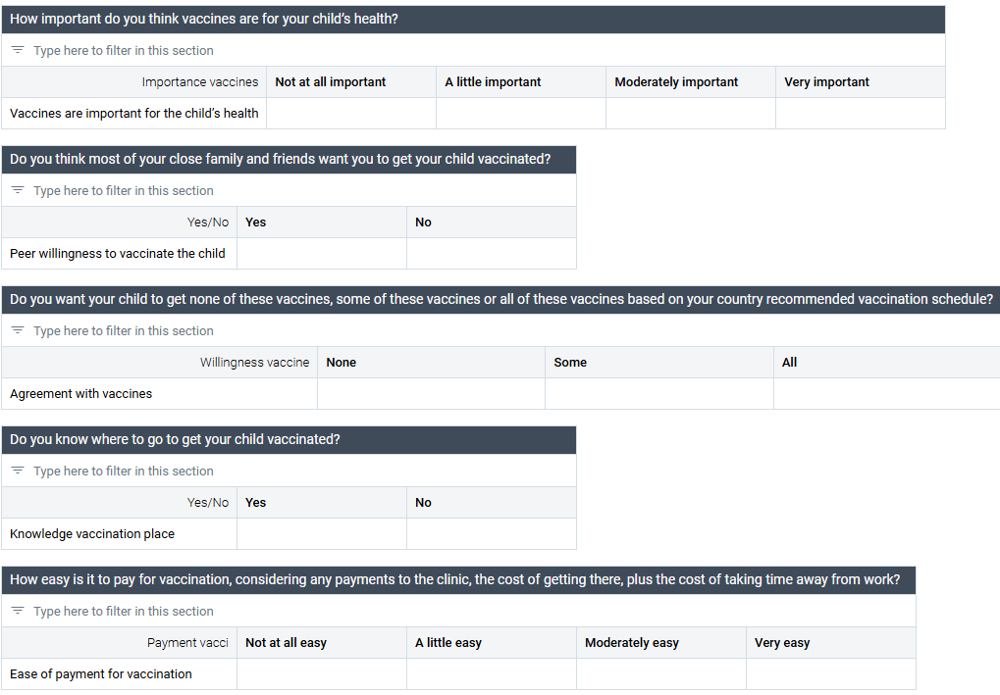

### Process Indicators - Staff training

The BCU framework also includes the monitoring of **staff trained in BCU activities**, ensuring that the workforce supporting this initiative is effectively tracked and assessed (“EPI-BCU - Staff” dataset). For countries that have already implemented the Health Facility Attribute (HFA) module, BCU staff training data elements can be seamlessly integrated into the existing framework. This integration simplifies data entry, reduces duplication, and ensures that BCU-specific training information is captured alongside other key health facility attributes, providing a more comprehensive view of workforce capacity.

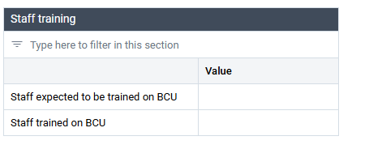

By embedding BCU training data into the [**Health Facility Attributes (HFA)**](https://docs.dhis2.org/en/implement/health/health-facility-profile/design.html#introduction), countries enhance the overall accuracy and utility of their health information systems. The HFA toolkit, designed to streamline the collection of health facility data, offers a comprehensive look at service availability, infrastructure, and resource preparedness. This integration into the national HMIS supports both routine data collection and strategic decision-making by ensuring that up-to-date personnel readiness data is easily accessible. Incorporating BCU-trained staff data into the HFA module **prevents double data entry and enriches the dataset, which is critical for planning, resource allocation, and timely responses to public health needs**. The flexible, modular approach of the HFA toolkit further enhances the ability to tailor data collection to specific requirements, ultimately improving health service delivery and public health preparedness through a unified, data-driven system.

### BCU Stock

The monitoring of BCU vaccine stock doses requested, received, and administered is critical for ensuring accountability in the Big Catch-Up (BCU) initiative. Tracking these doses not only ensures that vaccine supplies are effectively managed but also **provides transparency in the allocation and use of resources**. It is essential to report the subgroup of BCU doses as it ensures the BCU efforts are accurately reflected and accounted for within the RI framework. The BCU toolkit provides an “EPI-BCU - Stock” dataset.

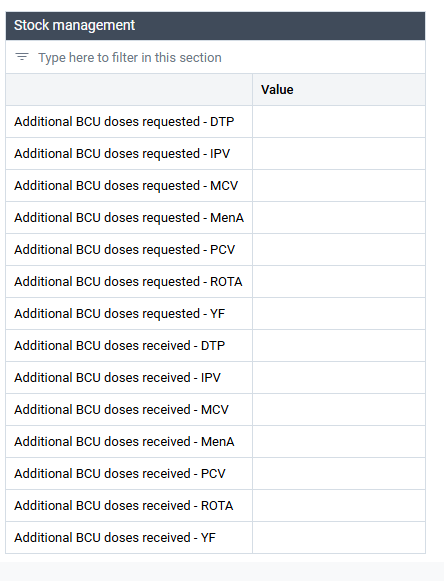

For countries with an existing stock module, **integrating BCU stock management into the current data and workflow structure enhances efficiency and supports streamlined reporting**. The [**LMIS (Logistics Management Information System) data model**](https://docs.dhis2.org/en/implement/health/immunization/epi-logistics/lmis-design.html), which offers a complete DHIS2 configuration, facilitates the adoption of logistics indicators and the triangulation of stock and service delivery data from the HMIS. While this configuration complements, rather than replaces, a fully functional LMIS, it is designed to promote best practices in the analysis of service delivery and logistics data, and provide standards for reporting stock data from health facilities. This integrated approach ensures that both the requested and received doses, as well as the specific BCU-administered doses, are accurately captured, supporting better resource planning, program management, and ultimately more effective immunization outcomes.

### BCU within the RI framework

The DHIS2 Toolkit Aggregate Design for the Big Catch-Up (BCU) initiative is a crucial component of **routine immunisation (RI) efforts** aimed at improving the tracking of immunization activities, particularly in identifying and reaching Zero-Dose (ZD) children. By developing a specialized DHIS2 Big Catch-Up module, this initiative seeks to enhance the monitoring of BCU activities and ensure seamless integration of BCU data with RI data. This effort aligns with broader DHIS2 data use strengthening initiatives, such as the Immunization Toolkit, to create a more cohesive and data-driven approach to immunization. Although the Big Catch-Up is a **time-bound intervention**, its overarching goal is to support long-term immunization programs that continually "catch up" and reach under-immunized (UI) children, contributing to more robust and sustainable public health outcomes.

The primary design of the BCU DHIS2 toolkit **embeds BCU-specific data points within the broader Routine Immunization (RI) framework** to ensure seamless integration and comprehensive monitoring. While the BCU dataset is focused on activities specific to the Big Catch-Up initiative, it is structured to complement and enhance overall immunization efforts within the RI monitoring system. This approach ensures that the targeted BCU activities are aligned with and contribute to the broader goals of routine immunization tracking. By integrating these two data streams, the toolkit strengthens the ability to monitor, track, and address ZD and UI children, while supporting long-term improvements in immunization program outcomes.

#### Vaccine administration

The BCU vaccine administration follows a simple flat design disaggregated by age groups (12-23 months and 24-59 months). The key antigens are reported by dose.

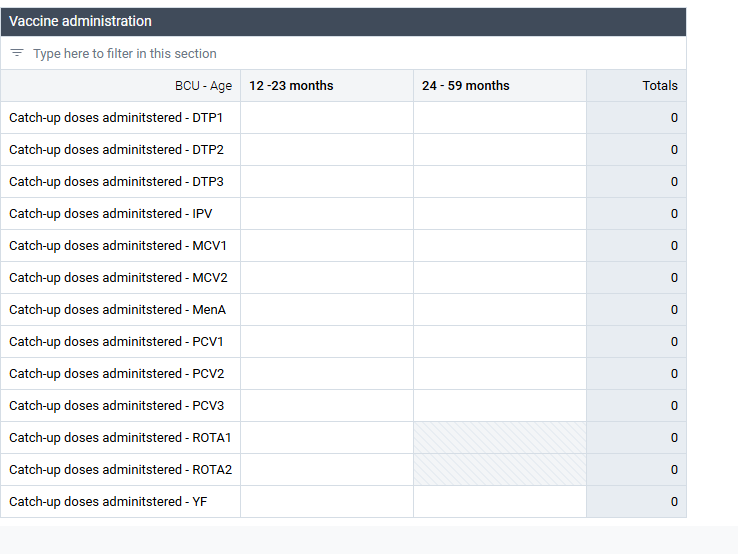

> Note:
>
> The standard EPI toolkit follows WHO guidelines, using age disaggregation of \<1 year and \>=1 year. However, the BCU toolkit monitors immunization efforts with more specific age groups, focusing on 12-23 months and 24-59 months. Depending on national implementation and local customization of age groups, countries may need to adjust the outputs to better align BCU activities with the overall RI monitoring framework. In cases where a country’s data entry form does not permit this level of disaggregation, it may be possible to report a single age group of 12-59 months instead. This adjustment will help provide a clearer understanding of the impact of BCU efforts on immunization coverage.

#### Population

As part of the routine immunization framework, the population of ZD and UI children, if not already incorporated into the existing parameters of the EPI system, should be aligned at the same organizational unit (OU) level as the general population data (e.g., district level). For the toolkit, population data has been included in the “EPI-BCU - Target Population” dataset to streamline grouping and simplify data management. This integration ensures that both ZD/UI children and routine immunization data are tracked consistently within the same organizational structure, enhancing the accuracy and ease of monitoring immunization efforts.

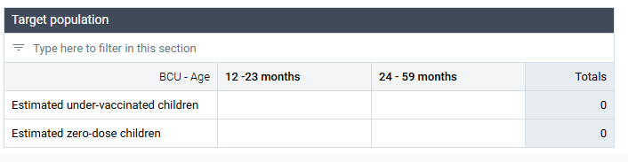

## EIR Adaptation for BCU

As mentioned above, the BCU DHIS2 toolkit is designed to support HIS that report BCU within the RI framework, as per global guidance (link). This section describes how the Electronic Immunization Registry (EIR) can be adapted to complement BCU activities within an integrated RI information system.

### EIR Overview

The Electronic Immunization Registry (EIR) was initially designed based on the [WHO recommendations for routine immunization of children (2018)](https://www.who.int/teams/immunization-vaccines-and-biologicals/policies/who-recommendations-for-routine-immunization---summary-tables), with the purpose of capturing data on both routine and non-routine vaccination schedules.

The EIR employs the DHIS2 Tracker data model to register and follow up individual children across the course of the national routine vaccination schedule. When a service provider or facility staff member creates a new visit to record a child’s latest Immunizations, the only routine vaccine dosages available to enter are those which are due or past due for the child, based on the child’s age and vaccine history at the time of visit.

Data entry for non-routine vaccinations, or those that are not due according to the national schedule, can be “unlocked” at each visit if the reason is documented in the visit record.

More details can be found at [EIR system design guide](https://docs.dhis2.org/en/implement/health/immunization/eir-immunization-eregistry/design.html) \### Preconditions for Adapting EIR in BCU context

When adapting and localizing Electronic Immunization Registry (EIR) metadata to the country’s health setting, it is essential to first assess how BCU and RI activities are being aggregated and reported. Mixed systems, where the same antigen might be reported as either BCU or routine, should be addressed promptly, as they risk under- or over-counting BCU activities, leading to inaccuracies in output indicators.

The guidance below therefore assumes that all BCU doses reported through the EIR are a subset of broader RI activities.

> Note:
>
> Disclaimer: The latest release of the EIR for DHIS2 version 2.40 does not have BCU components by default, but these are displayed on the [HMIS demo](demos.dhis2.org/hmis) and can be added as needed based on country setting.

### BCU dose reporting

The prototype EIR with BCU reporting (screenshot below) includes additional data elements for BCU doses provided at individual level. These data could be aggregated to populate the BCU “Vaccine administration” data set.

The seven BCU antigens are added as “Yes Only” data elements to the Immunization program stage within their own section. These data elements indicate that the dose provided was specifically a part of BCU activity. They are hidden by default via Program Rules.

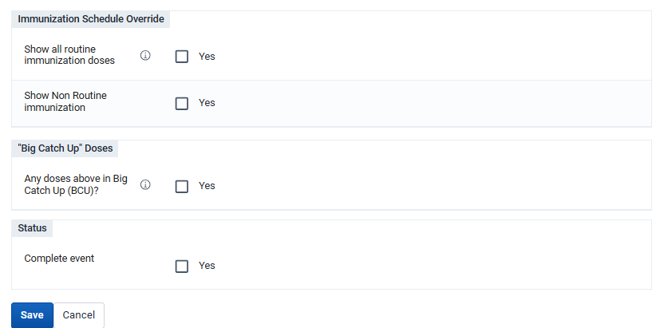

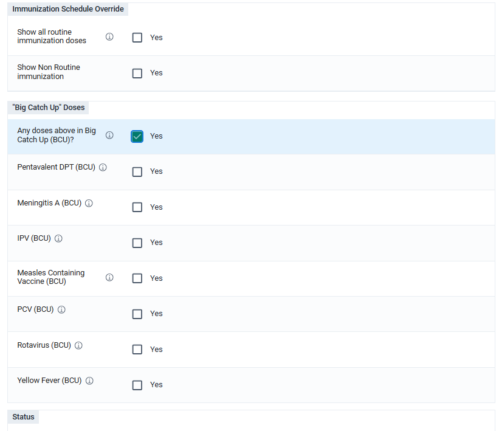

### Program rules for BCU

Within the typical workflow, the clinic user enters in all Immunizations administered to the child during the Visit. Before clicking “Complete Event” to finish the Visit record, the user is prompted with another “Yes Only” data element: Any of the doses above in Big Catch Up (BCU)? By clicking Yes, the user un-hides all seven data elements indicating a BCU antigen.

For an additional level of data validation, clicking Yes for any BCU data element will show an error if the corresponding RI data element for that antigen was not also a Yes value.

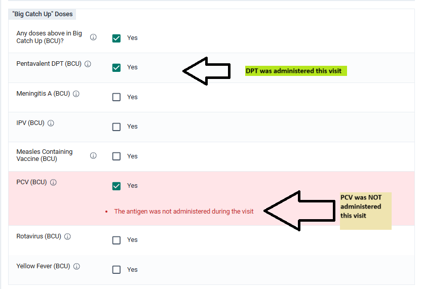

### Program indicators for BCU

In order to feed into the “Vaccines Administered” BCU data set, the EIR data elements are aggregated via Program Indicators.

For each antigen dose, two separate program indicators calculate the number of BCU doses administered to children in the 12-23 months and 24-59 months age brackets. These then feed into the Vaccines Administered BCU data set with the EIR to EPI data exchange. For configuration, the BCU program indicators extend off the standard program indicators for the EIR.

For example, see the EIR Program Indicator for IPV doses given (\< 1 yr). The standard condition for this RI program indicator is: `Immunization.EIR - IPV 1 == 1 && (d2:daysBetween(GEN - Date of birth,Event date)) \< 365`

Cloning this program indicator and making a few changes will capture BCU doses of IPV for 12-23 months. New condition for BCU doses: `Immunization.EIR - IPV 1 == 1 && (d2:monthsBetween(GEN - Date of birth,Event date)) \>= 12 && (d2:monthsBetween(GEN - Date of birth,Event date)) \<= 23 && Immunization.EIR - IPV (BCU) == 1`

The added sub-conditions (in bold) make sure to only capture *Immunization visits where the patient was between 12 and 23 months at IPV 1 dose administration, **and** the BCU dose was marked “Yes” for IPV.*

Next, the administrator will need to set up a Data Exchange to relate this program indicator to the correct aggregate data element and category option combination. For details, see the [Data Exchange guide](https://docs.dhis2.org/en/use/user-guides/dhis-core-version-master/exchanging-data/data-exchange.html).

### Other tips for adapting EIR for BCU

#### Multiselect option sets are available in 241

As of version 2.41, “multi-text” is available as a data element value type in Capture. This means that a field could hold multiple values of an option set at once. An EIR in version 2.41 could employ multi-text and program rules to select all of the RI doses which were part of BCU. A single data element for “BCU doses provided” would only show eligible doses administered in the routine immunization section as multi-text options. Such a design would provide a cleaner and more compact user interface and streamline data analysis.

#### Android version and skip logic

Many rural health centres with limited internet access, can benefit from the offline data entry capabilities of the DHIS2 Capture App on Android devices. However, a bug in the Android app related to the function `d2:lastEventDate()` breaks the program rules that enable the skip logic of the EIR’s schedule. As a result of this error, the end user will see and enter any available doses of an antigen’s schedule at the first visit. This bug is being fixed by February 2025. The core team recommends using [a version of the Android app above v 3.1.0.1](https://github.com/dhis2/dhis2-android-capture-app/releases/tag/3.1.0.1)

## Dashboard and Analytics

The aggregate and tracker modules analyze the data on coverage and distribution via the Immunisation dashboard. The BCU-specific data points and indicators (e.g. BeSD, distribution of BCU doses, staff training) are monitored in the EPI-Big Catch-up Dashboard. The dashboard is available in the [HMIS Demo](https://demos.dhis2.org/hmis) instance.

The dashboard is structured in three parts:

1.  **BCU process indicators**: Visualizations to monitor the requested and received doses by antigen, and to oversee the trainings of the staff.

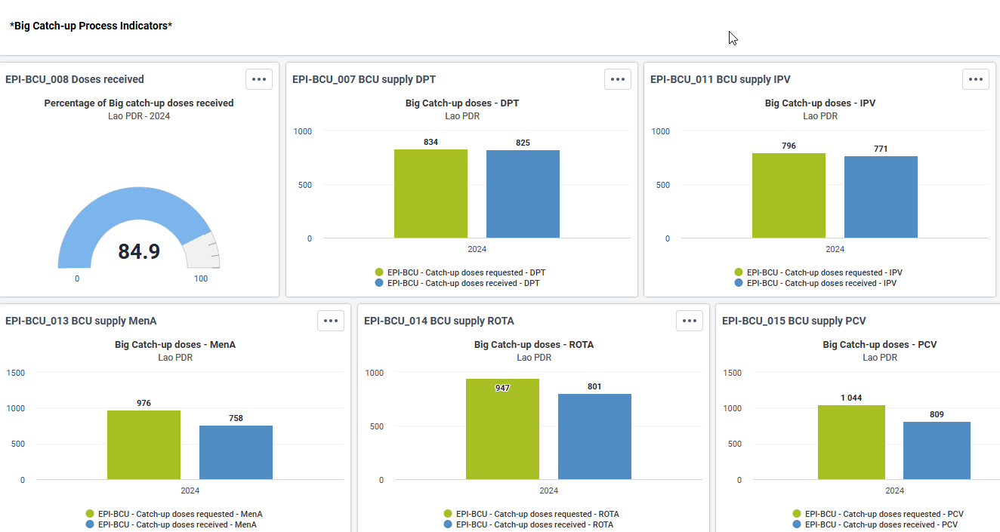

2.  **BCU coverage indicators**: Visualizations to monitor by antigen the number of BCU doses distributed by age group, to observe the doses distributed in the eligible cohort from the year before, to check the BCU vaccine coverage within the UI/ZD targeted children, and maps. Page 27 of the [global guidance on BCU](https://www.technet-21.org/en/resources/guidance/monitoring-and-reporting-of-essential-immunization-catch-up-in-the-context-of-the-big-catch-up) provides further insights on visualizations and interpretations of the outputs.

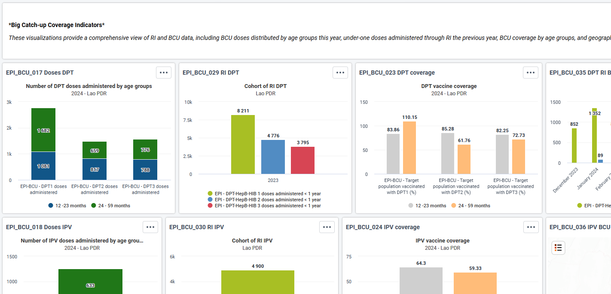

3.  **BCU Behavioural and Social Drivers of Vaccination (BeSD) Childhood Vaccination Indicators**: Visualizations to monitor the overall key indicators of attitudes and perceptions toward vaccines and a breakdown by aggregated answer by question.

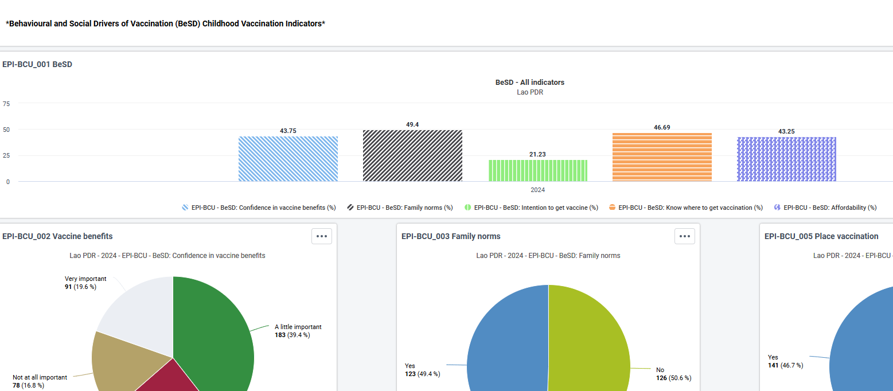

### Coverage Indicators

As the additional BCU-specific indicators focus solely on monitoring the **percentage of target ZD or UI children reached by BCU efforts** (e.g. EPI-BCU - Target population vaccinated with PCV (%)), the DEs for BCU vaccine distribution are separate from the EPI routine DEs. It becomes necessary to adapt the EPI coverage indicators to ensure that the BCU doses are included. This adjustment is crucial to provide an accurate reflection of overall immunization coverage and to capture the full scope of both routine and catch-up vaccination activities, especially during population-based surveys.

This activity is highly dependent on the local configuration of the EPI system and it is therefore not preconfigured in the standard BCU or EPI toolkits.
